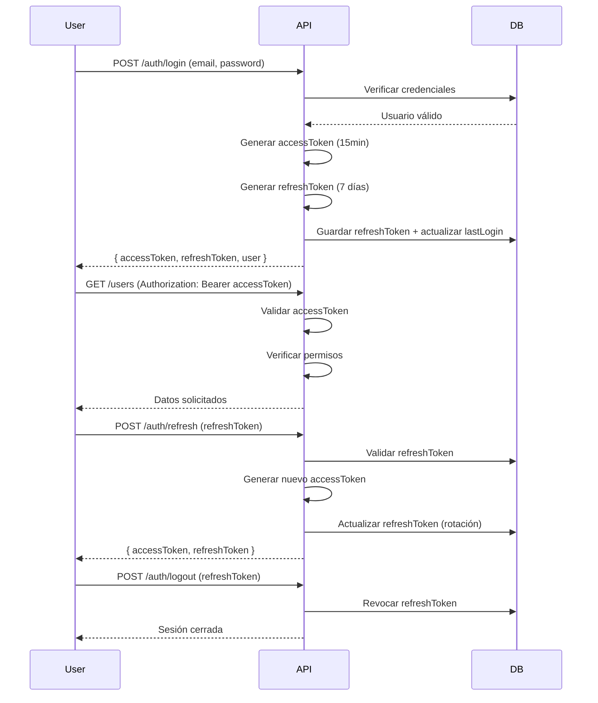

# 📦 Inventory System API

> [🔗 Ver documentación detallada de la API en context.md](context.md)

Backend moderno y escalable para sistema de inventarios con autenticación JWT, control de acceso basado en roles y permisos, y gestión de almacenes.

---

## 🧱 Stack Tecnológico

- **Runtime**: Node.js + TypeScript 5.3.0
- **Framework**: Express 5.2.1
- **ORM**: Drizzle ORM 0.45.1
- **Base de datos**: MySQL (mysql2 3.16.0)
- **Autenticación**: JWT (jsonwebtoken 9.0.2)
- **Validación**: Zod 4.3.5
- **Seguridad**: bcrypt 6.0.0, helmet 8.1.0, cors 2.8.5
- **Logger**: morgan 1.10.1

---

## 🗂️ Estructura del Proyecto

```
src/
├── db/
│   ├── connection.ts                # Conexión a MySQL
│   ├── migrate.ts                   # Script de migración y seeds
│   └── schema/                      # Schemas Drizzle
│       ├── index.ts
│       ├── users.ts                 # Usuarios (con lastLogin)
│       ├── roles.ts                 # Roles del sistema
│       ├── permissions.ts           # Permisos granulares
│       ├── role_permissions.ts      # Relación roles-permisos
│       ├── user_roles.ts            # Relación usuarios-roles
│       ├── warehouses.ts            # Almacenes
│       ├── user_warehouses.ts       # Relación usuarios-almacenes
│       └── refresh_tokens.ts        # Tokens de refresco
├── middlewares/
│   ├── auth.middleware.ts           # Validación de JWT
│   ├── authorization.middleware.ts  # Control por permisos/roles
│   └── validate.ts                  # Validación con Zod
├── modules/
│   ├── auth/                        # Autenticación (login, refresh, logout, me)
│   ├── users/                       # Gestión de usuarios
│   ├── roles/                       # Gestión de roles
│   ├── permissions/                 # Gestión de permisos
│   └── warehouses/                  # Gestión de almacenes
├── utils/
│   └── jwt.ts                       # Utilidades JWT
├── app.ts                           # Configuración Express
└── server.ts                        # Punto de entrada
```

---

## 🚀 Instalación y Configuración

### 1. Instalar dependencias
```bash
npm install
```

### 2. Configurar variables de entorno
Crea un archivo `.env` en la raíz del proyecto:
```env
PORT=3000
DB_HOST=localhost
DB_PORT=3306
DB_USER=root
DB_PASSWORD=tu_password
DB_NAME=inventory
JWT_SECRET=tu_secreto_super_seguro
JWT_REFRESH_SECRET=otro_secreto_diferente
```

### 3. Crear base de datos y ejecutar migraciones
```bash
# Crear base de datos (ejecuta el SQL en sql/CREATE DATABASE `inventory`.sql)
mysql -u root -p < "sql/CREATE DATABASE \`inventory\`.sql"

# Ejecutar migraciones y seeds
npm run migrate
```

### 4. Iniciar servidor
```bash
# Desarrollo
npm run dev

# Producción
npm run build
npm start
```

El servidor estará disponible en `http://localhost:3000`

---

## 🔐 Sistema de Autenticación

### Flujo de Autenticación



### Características
- **Access Token**: 15 minutos de validez, JWT firmado
- **Refresh Token**: 7 días de validez, almacenado en BD con rotación
- **Logout seguro**: Revocación real del refresh token
- **lastLogin**: Registro automático de última sesión
- **Sin registro público**: Los usuarios solo pueden ser creados por administradores con permisos

---

## 🛡️ Sistema de Roles y Permisos

### Arquitectura RBAC (Role-Based Access Control)

El sistema implementa control de acceso granular con:

| Tabla | Descripción |
|-------|-------------|
| **roles** | Roles del sistema (ej: Admin, Manager, Seller) |
| **permissions** | Permisos específicos (ej: users.create, warehouses.read) |
| **role_permissions** | Asignación de permisos a roles (muchos a muchos) |
| **user_roles** | Asignación de roles a usuarios (muchos a muchos) |

### Permisos del Sistema (14 permisos)

#### Usuarios (6 permisos)
- `users.read` - Ver usuarios
- `users.create` - Crear usuarios
- `users.update` - Actualizar usuarios
- `users.delete` - Eliminar usuarios
- `users.assign_roles` - Asignar roles a usuarios
- `users.assign_warehouses` - Asignar almacenes a usuarios

#### Almacenes (4 permisos)
- `warehouses.read` - Ver almacenes
- `warehouses.create` - Crear almacenes
- `warehouses.update` - Actualizar almacenes
- `warehouses.delete` - Eliminar almacenes

#### Roles (4 permisos)
- `roles.read` - Ver roles
- `roles.create` - Crear roles
- `roles.update` - Actualizar roles
- `roles.delete` - Eliminar roles

### Ejemplo de Uso
```typescript
// Proteger ruta con permiso específico
router.get('/', authenticateToken, hasPermission('users.read'), getUsers);

// Proteger ruta con rol específico
router.delete('/:id', authenticateToken, isRole('admin'), deleteUser);
```

---

## 🛠️ Endpoints Principales

> [📖 Documentación completa con ejemplos CURL en context.md](context.md)

### 📁 Auth (4 endpoints)
- `POST /auth/login` - Iniciar sesión
- `POST /auth/refresh` - Renovar access token
- `POST /auth/logout` - Cerrar sesión
- `GET /auth/me` - Obtener usuario autenticado

### 👥 Users (7 endpoints)
- `GET /users` - Listar usuarios (requiere `users.read`)
- `GET /users/:id` - Ver usuario específico
- `POST /users` - Crear usuario con roles y almacenes (requiere `users.create`)
- `PUT /users/:id` - Actualizar usuario
- `DELETE /users/:id` - Eliminar usuario
- `POST /users/:id/roles` - Asignar roles
- `POST /users/:id/warehouses` - Asignar almacenes

### 🏷️ Roles (5 endpoints)
- `GET /roles` - Listar roles (requiere `roles.read`)
- `GET /roles/:id` - Ver rol específico
- `POST /roles` - Crear rol (requiere `roles.create`)
- `PUT /roles/:id` - Actualizar rol
- `DELETE /roles/:id` - Eliminar rol

### 🔑 Permissions (2 endpoints)
- `GET /permissions` - Listar todos los permisos (solo auth)
- `POST /permissions` - Crear permiso (solo admin)

### 🏢 Warehouses (8 endpoints)
- `GET /warehouses` - Listar almacenes (requiere `warehouses.read`)
- `GET /warehouses/:id` - Ver almacén específico
- `POST /warehouses` - Crear almacén (requiere `warehouses.create`)
- `PUT /warehouses/:id` - Actualizar almacén
- `DELETE /warehouses/:id` - Eliminar almacén
- `GET /warehouses/:id/users` - Listar usuarios del almacén
- `POST /warehouses/:id/users` - Asignar usuarios al almacén
- `DELETE /warehouses/:id/users/:userId` - Remover usuario del almacén

**Total: 26 endpoints**

---

## 🧰 Middlewares

### 1. `authenticateToken`
Valida la presencia y validez del JWT en el header `Authorization: Bearer <token>`.

```typescript
import { authenticateToken } from '../middlewares/auth.middleware';

router.get('/protected', authenticateToken, (req, res) => {
  res.json({ user: req.user }); // req.user contiene los datos del token
});
```

### 2. `hasPermission(permission: string)`
Verifica que el usuario tenga un permiso específico.

```typescript
import { hasPermission } from '../middlewares/authorization.middleware';

router.post('/users', 
  authenticateToken, 
  hasPermission('users.create'), 
  createUser
);
```

### 3. `isRole(roleName: string)`
Verifica que el usuario tenga un rol específico (usado para rutas admin).

```typescript
import { isRole } from '../middlewares/authorization.middleware';

router.delete('/sensitive', 
  authenticateToken, 
  isRole('admin'), 
  deleteSensitiveData
);
```

### 4. `validate(schema: ZodSchema)`
Valida el body, query params y route params usando Zod.

```typescript
import { validate } from '../middlewares/validate';
import { createUserSchema } from './users.schemas';

router.post('/users', 
  authenticateToken,
  validate(createUserSchema),
  createUser
);
```

**Formato estándar de schemas Zod:**
```typescript
export const createUserSchema = z.object({
  body: z.object({
    email: z.string().email(),
    password: z.string().min(6),
    roleIds: z.array(z.number()).min(1),
    warehouseIds: z.array(z.number()).optional()
  }),
  query: z.object({}).optional(),
  params: z.object({}).optional()
});
```

---

## 💾 Tablas de la Base de Datos

| Tabla | Descripción |
|-------|-------------|
| **users** | Usuarios del sistema (email, password, lastLogin) |
| **roles** | Roles del sistema (name, description) |
| **permissions** | Permisos granulares (name, description, group) |
| **role_permissions** | Relación muchos a muchos entre roles y permisos |
| **user_roles** | Relación muchos a muchos entre usuarios y roles |
| **warehouses** | Almacenes (name, provincia, municipio, direccion, ubicacion) |
| **user_warehouses** | Relación muchos a muchos entre usuarios y almacenes |
| **refresh_tokens** | Tokens de refresco activos (token, userId, expiresAt) |

**Características:**
- Todas las tablas usan `id` como clave primaria
- Relaciones con `CASCADE` en eliminaciones
- Timestamps automáticos (`createdAt`, `updatedAt`)
- Índices en campos clave (email, token, roleId, etc.)

---

## 🔒 Características de Seguridad

- ✅ **bcrypt** para hashing de contraseñas (salt rounds: 10)
- ✅ **JWT** con expiración corta (15 minutos)
- ✅ **Refresh tokens** con rotación automática (7 días)
- ✅ **Revocación de tokens** en logout real
- ✅ **CORS** configurado
- ✅ **Helmet** para headers de seguridad
- ✅ **Validación estricta** de inputs con Zod
- ✅ **Control granular** de permisos por endpoint
- ✅ **lastLogin tracking** para auditoría
- ✅ **Sin registro público** (solo admins crean usuarios)

---

## 📚 Documentación

- **[context.md](context.md)**: Documentación técnica completa con ejemplos CURL para cada endpoint
- **README.md** (este archivo): Visión general del proyecto, instalación y arquitectura

---

## 📝 Licencia

Este proyecto está bajo la licencia especificada en [LICENSE](LICENSE).

---
