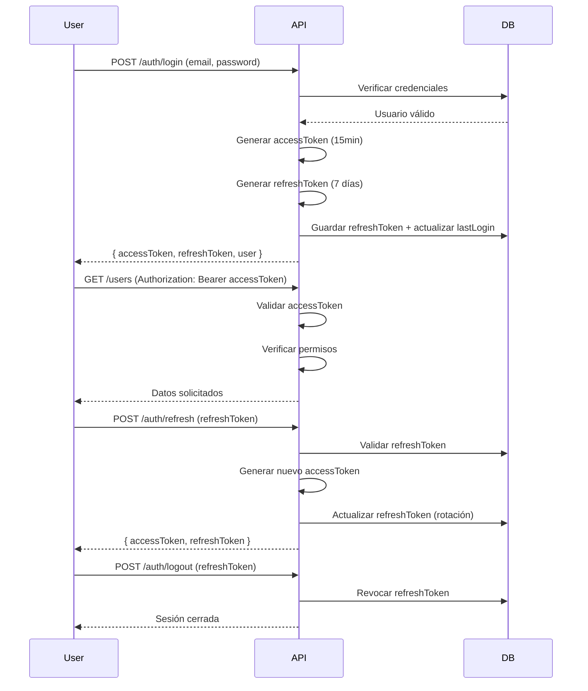

# 📦 Inventory System API

## 📚 Navegación de Documentación

- 📖 **[README.md](README.md)** - Visión general, instalación y arquitectura (estás aquí)
- 🔧 **[context.md](context.md)** - Documentación técnica completa con ejemplos CURL
- 🎨 **[FRONTEND-INTEGRATION.md](FRONTEND-INTEGRATION.md)** - Guía de integración con frontend
- 📊 **[REPORTES.md](REPORTES.md)** - Documentación de reportes y analytics

---

Backend moderno y escalable para sistema de inventarios con autenticación JWT, control de acceso basado en roles y permisos, y gestión de almacenes.

---

## 🧱 Stack Tecnológico

- **Runtime**: Node.js + TypeScript 5.3.0
- **Framework**: Express 5.2.1
- **ORM**: Drizzle ORM 0.45.1
- **Base de datos**: MySQL (mysql2 3.16.0)
- **Autenticación**: JWT (jsonwebtoken 9.0.2)
- **Validación**: Zod 4.3.5
- **Seguridad**: bcrypt 6.0.0, helmet 8.1.0, cors 2.8.5
- **Logger**: morgan 1.10.1

---

## 🗂️ Estructura del Proyecto

```
src/
├── db/
│   ├── connection.ts                # Conexión a MySQL
│   ├── migrate.ts                   # Script de migración y seeds
│   └── schema/                      # Schemas Drizzle
│       ├── index.ts
│       ├── users.ts                 # Usuarios (con lastLogin)
│       ├── roles.ts                 # Roles del sistema
│       ├── permissions.ts           # Permisos granulares
│       ├── role_permissions.ts      # Relación roles-permisos
│       ├── user_roles.ts            # Relación usuarios-roles
│       ├── warehouses.ts            # Almacenes
│       ├── user_warehouses.ts       # Relación usuarios-almacenes
│       ├── refresh_tokens.ts        # Tokens de refresco
│       ├── units.ts                 # Unidades de medida
│       ├── currencies.ts            # Monedas
│       ├── exchange_rates.ts        # Tasas de cambio
│       ├── categories.ts            # Categorías de productos
│       ├── products.ts              # Productos
│       ├── payment_types.ts         # Tipos de pago
│       ├── inventory.ts             # Inventario por almacén
│       ├── inventory_movements.ts   # Movimientos de inventario (kardex)
│       ├── purchases.ts             # Compras
│       ├── purchases_detail.ts      # Detalle de compras
│       ├── sales.ts                 # Ventas
│       ├── sales_detail.ts          # Detalle de ventas
│       ├── transfers.ts             # Traslados entre almacenes
│       └── transfers_detail.ts      # Detalle de traslados
├── middlewares/
│   ├── auth.middleware.ts           # Validación de JWT
│   ├── authorization.middleware.ts  # Control por permisos/roles
│   └── validate.ts                  # Validación con Zod
├── modules/
│   ├── auth/                        # Autenticación (login, refresh, logout, me)
│   ├── users/                       # Gestión de usuarios
│   ├── roles/                       # Gestión de roles
│   ├── permissions/                 # Gestión de permisos
│   ├── warehouses/                  # Gestión de almacenes
│   ├── units/                       # Unidades de medida
│   ├── currencies/                  # Monedas
│   ├── exchange_rates/              # Tasas de cambio
│   ├── categories/                  # Categorías de productos
│   ├── products/                    # Productos
│   ├── payment_types/               # Tipos de pago
│   ├── inventory/                   # Inventario (stock, kardex, ajustes)
│   ├── purchases/                   # Compras (CRUD, aceptar, cancelar)
│   ├── sales/                       # Ventas (CRUD, aceptar, cancelar, reportes)
│   └── transfers/                   # Traslados (CRUD, aceptar, rechazar, reportes)
├── utils/
│   └── jwt.ts                       # Utilidades JWT
├── app.ts                           # Configuración Express
└── server.ts                        # Punto de entrada
```

---

## 🚀 Instalación y Configuración

### 1. Instalar dependencias
```bash
npm install
```

### 2. Configurar variables de entorno
Crea un archivo `.env` en la raíz del proyecto:
```env
PORT=3000
DB_HOST=localhost
DB_PORT=3306
DB_USER=root
DB_PASSWORD=tu_password
DB_NAME=inventory
JWT_SECRET=tu_secreto_super_seguro
JWT_REFRESH_SECRET=otro_secreto_diferente
```

### 3. Crear base de datos y ejecutar migraciones
```bash
# Crear base de datos (ejecuta el SQL en sql/CREATE DATABASE `inventory`.sql)
mysql -u root -p < "sql/CREATE DATABASE \`inventory\`.sql"

# Ejecutar migraciones y seeds
npm run migrate
```

### 4. Iniciar servidor
```bash
# Desarrollo
npm run dev

# Producción
npm run build
npm start
```

El servidor estará disponible en `http://localhost:3000`

---

## 🔐 Sistema de Autenticación

### Flujo de Autenticación



### Características
- **Access Token**: 15 minutos de validez, JWT firmado
- **Refresh Token**: 7 días de validez, almacenado en BD con rotación
- **Logout seguro**: Revocación real del refresh token
- **lastLogin**: Registro automático de última sesión
- **Sin registro público**: Los usuarios solo pueden ser creados por administradores con permisos

---

## 🛡️ Sistema de Roles y Permisos

### Arquitectura RBAC (Role-Based Access Control)

El sistema implementa control de acceso granular con:

| Tabla | Descripción |
|-------|-------------|
| **roles** | Roles del sistema (ej: Admin, Manager, Seller) |
| **permissions** | Permisos específicos (ej: users.create, warehouses.read) |
| **role_permissions** | Asignación de permisos a roles (muchos a muchos) |
| **user_roles** | Asignación de roles a usuarios (muchos a muchos) |

### Permisos del Sistema (38 permisos)

#### Usuarios (6 permisos)
- `users.read` - Ver usuarios
- `users.create` - Crear usuarios
- `users.update` - Actualizar usuarios
- `users.delete` - Eliminar usuarios
- `users.roles.associate` - Asignar roles a usuarios
- `users.warehouses.associate` - Asignar almacenes a usuarios

#### Almacenes (4 permisos)
- `warehouses.read` - Ver almacenes
- `warehouses.create` - Crear almacenes
- `warehouses.update` - Actualizar almacenes
- `warehouses.delete` - Eliminar almacenes

#### Roles (4 permisos)
- `roles.read` - Ver roles
- `roles.create` - Crear roles
- `roles.update` - Actualizar roles
- `roles.delete` - Eliminar roles

#### Unidades de Medida (4 permisos)
- `units.read` - Ver unidades
- `units.create` - Crear unidades
- `units.update` - Actualizar unidades
- `units.delete` - Eliminar unidades

#### Monedas (4 permisos)
- `currencies.read` - Ver monedas
- `currencies.create` - Crear monedas
- `currencies.update` - Actualizar monedas
- `currencies.delete` - Eliminar monedas

#### Tasas de Cambio (4 permisos)
- `exchange_rates.read` - Ver tasas de cambio
- `exchange_rates.create` - Crear tasas de cambio
- `exchange_rates.update` - Actualizar tasas de cambio
- `exchange_rates.delete` - Eliminar tasas de cambio

#### Categorías (4 permisos)
- `categories.read` - Ver categorías
- `categories.create` - Crear categorías
- `categories.update` - Actualizar categorías
- `categories.delete` - Eliminar categorías

#### Productos (4 permisos)
- `products.read` - Ver productos
- `products.create` - Crear productos
- `products.update` - Actualizar productos
- `products.delete` - Eliminar productos

#### Tipos de Pago (4 permisos)
- `payment_types.read` - Ver tipos de pago
- `payment_types.create` - Crear tipos de pago
- `payment_types.update` - Actualizar tipos de pago
- `payment_types.delete` - Eliminar tipos de pago

#### Inventario (4 permisos)
- `inventory.read` - Ver inventario y stock
- `inventory.create` - Crear movimientos de inventario
- `inventory.update` - Actualizar inventario
- `inventory.adjust` - Realizar ajustes de inventario

#### Compras (4 permisos)
- `purchases.read` - Ver compras
- `purchases.create` - Crear compras
- `purchases.update` - Actualizar compras
- `purchases.delete` - Eliminar compras

#### Ventas (4 permisos)
- `sales.read` - Ver ventas
- `sales.create` - Crear ventas
- `sales.update` - Actualizar ventas
- `sales.delete` - Eliminar ventas

#### Traslados (3 permisos)
- `transfers.read` - Ver traslados
- `transfers.create` - Crear traslados
- `transfers.update` - Actualizar traslados

**Total: 49 permisos**

### Ejemplo de Uso
```typescript
// Proteger ruta con permiso específico
router.get('/', authenticateToken, hasPermission('users.read'), getUsers);

// Proteger ruta con rol específico
router.delete('/:id', authenticateToken, isRole('admin'), deleteUser);
```

---

## 🛠️ Endpoints Principales

> [📖 Documentación completa con ejemplos CURL en context.md](context.md)

### 📁 Auth (5 endpoints)
- `POST /auth/login` - Iniciar sesión
- `POST /auth/refresh` - Renovar access token
- `POST /auth/logout` - Cerrar sesión
- `GET /auth/me` - Obtener usuario autenticado
- `PUT /auth/change-password` - Cambiar contraseña propia (sin permisos)

### 👥 Users (8 endpoints)
- `GET /users` - Listar usuarios (requiere `users.read`)
- `GET /users/:id` - Ver usuario específico
- `POST /users` - Crear usuario con nombre, roles y almacenes (requiere `users.create`)
- `PUT /users/:id` - Actualizar usuario (email, password, nombre, apellido, telefono)
- `PUT /users/:id/disable` - Deshabilitar usuario (soft delete, requiere `users.delete`)
- `PUT /users/:id/enable` - Habilitar usuario (requiere `users.update`)
- `POST /users/:id/roles` - Asignar roles
- `POST /users/:id/warehouses` - Asignar almacenes

### 🏷️ Roles (5 endpoints)
- `GET /roles` - Listar roles (requiere `roles.read`)
- `GET /roles/:id` - Ver rol específico
- `POST /roles` - Crear rol (requiere `roles.create`)
- `PUT /roles/:id` - Actualizar rol
- `DELETE /roles/:id` - Eliminar rol

### 🔑 Permissions (2 endpoints)
- `GET /permissions` - Listar todos los permisos (solo auth)
- `POST /permissions` - Crear permiso (solo admin)

### 🏢 Warehouses (8 endpoints)
- `GET /warehouses` - Listar almacenes (requiere `warehouses.read`)
- `GET /warehouses/:id` - Ver almacén específico
- `POST /warehouses` - Crear almacén (requiere `warehouses.create`)
- `PUT /warehouses/:id` - Actualizar almacén
- `DELETE /warehouses/:id` - Eliminar almacén
- `GET /warehouses/:id/users` - Listar usuarios del almacén
- `POST /warehouses/:id/users` - Asignar usuarios al almacén
- `DELETE /warehouses/:id/users/:userId` - Remover usuario del almacén

### 📏 Units (5 endpoints)
- `GET /units` - Listar unidades (requiere `units.read`)
- `GET /units/:id` - Ver unidad específica
- `POST /units` - Crear unidad (requiere `units.create`)
- `PUT /units/:id` - Actualizar unidad
- `PUT /units/:id/disable` - Deshabilitar unidad (soft delete)
- `PUT /units/:id/enable` - Habilitar unidad

### 💰 Currencies (5 endpoints)
- `GET /currencies` - Listar monedas (requiere `currencies.read`)
- `GET /currencies/:id` - Ver moneda específica
- `POST /currencies` - Crear moneda (requiere `currencies.create`)
- `PUT /currencies/:id` - Actualizar moneda
- `PUT /currencies/:id/disable` - Deshabilitar moneda (soft delete)
- `PUT /currencies/:id/enable` - Habilitar moneda

### 💱 Exchange Rates (6 endpoints)
- `GET /exchange-rates` - Listar tasas de cambio (requiere `exchange_rates.read`)
- `GET /exchange-rates/:id` - Ver tasa específica
- `GET /exchange-rates/latest/:from/:to` - Obtener última tasa entre dos monedas
- `POST /exchange-rates` - Crear tasa de cambio (requiere `exchange_rates.create`)
- `PUT /exchange-rates/:id` - Actualizar tasa
- `DELETE /exchange-rates/:id` - Eliminar tasa

### 🏷️ Categories (5 endpoints)
- `GET /categories` - Listar categorías (requiere `categories.read`)
- `GET /categories/:id` - Ver categoría específica
- `POST /categories` - Crear categoría (requiere `categories.create`)
- `PUT /categories/:id` - Actualizar categoría
- `PUT /categories/:id/disable` - Deshabilitar categoría (soft delete)
- `PUT /categories/:id/enable` - Habilitar categoría

### 📦 Products (6 endpoints)
- `GET /products` - Listar productos (requiere `products.read`)
- `GET /products/:id` - Ver producto específico
- `GET /products/category/:categoryId` - Listar productos por categoría
- `POST /products` - Crear producto (requiere `products.create`)
- `PUT /products/:id` - Actualizar producto
- `PUT /products/:id/disable` - Deshabilitar producto (soft delete)
- `PUT /products/:id/enable` - Habilitar producto

### 💳 Payment Types (5 endpoints)
- `GET /payment-types` - Listar tipos de pago (requiere `payment_types.read`)
- `GET /payment-types/:id` - Ver tipo de pago específico
- `POST /payment-types` - Crear tipo de pago (requiere `payment_types.create`)
- `PUT /payment-types/:id` - Actualizar tipo de pago
- `PUT /payment-types/:id/disable` - Deshabilitar tipo de pago (soft delete)
- `PUT /payment-types/:id/enable` - Habilitar tipo de pago

### 📊 Inventory (6 endpoints)
- `GET /inventory/product/:productId` - Ver stock de un producto en todos los almacenes (requiere `inventory.read`)
- `GET /inventory/warehouse/:warehouseId` - Ver stock completo de un almacén
- `GET /inventory/kardex/:productId/:warehouseId` - Ver kardex (historial de movimientos)
- `POST /inventory/adjust-entry` - Ajuste de entrada manual (requiere `inventory.adjust`)
- `POST /inventory/adjust-exit` - Ajuste de salida manual (requiere `inventory.adjust`)
- `GET /inventory/reports/value` - Reporte de inventario valorizado
- `GET /inventory/reports/adjustments` - Reporte de ajustes (requiere fechas)

### 🛒 Purchases (7 endpoints)
- `GET /purchases` - Listar compras (requiere `purchases.read`)
- `GET /purchases/:id` - Ver compra específica
- `POST /purchases` - Crear compra (requiere `purchases.create`)
- `PUT /purchases/:id` - Actualizar compra en PENDING (requiere `purchases.update`)
- `PUT /purchases/:id/accept` - Aceptar compra y actualizar inventario (requiere `purchases.update`)
- `PUT /purchases/:id/cancel` - Cancelar compra y revertir inventario (requiere `purchases.delete`)
- `DELETE /purchases/:id` - Eliminar compra en PENDING (requiere `purchases.delete`)

### 💵 Sales (9 endpoints)
- `GET /sales` - Listar ventas (requiere `sales.read`)
- `GET /sales/:id` - Ver venta específica
- `POST /sales` - Crear venta (requiere `sales.create`)
- `PUT /sales/:id` - Actualizar venta en PENDING (requiere `sales.update`)
- `PUT /sales/:id/accept` - Aceptar venta y actualizar inventario (requiere `sales.update`)
- `PUT /sales/:id/cancel` - Cancelar venta y revertir inventario (requiere `sales.delete`)
- `DELETE /sales/:id` - Eliminar venta en PENDING (requiere `sales.delete`)
- `GET /sales/reports/totals` - Reporte de ventas totales con conversión (requiere fechas)
- `GET /sales/reports/cancelled` - Reporte de ventas canceladas (requiere fechas)

### 🔄 Transfers (8 endpoints)
- `GET /transfers` - Listar traslados (requiere `transfers.read`)
- `GET /transfers/:id` - Ver traslado específico
- `POST /transfers` - Crear traslado (requiere `transfers.create`)
- `PUT /transfers/:id` - Actualizar traslado en PENDING (requiere `transfers.update`)
- `PUT /transfers/:id/accept` - Aceptar traslado y mover inventario (requiere `transfers.update`)
- `PUT /transfers/:id/reject` - Rechazar traslado (requiere `transfers.update`)
- `DELETE /transfers/:id` - Eliminar traslado en PENDING (requiere `transfers.update`)
- `GET /transfers/reports/rejected` - Reporte de traslados rechazados (requiere fechas)

**Total: 76 endpoints** (5 reportes incluidos)

---

## 🧰 Middlewares

### 1. `authenticateToken`
Valida la presencia y validez del JWT en el header `Authorization: Bearer <token>`.

```typescript
import { authenticateToken } from '../middlewares/auth.middleware';

router.get('/protected', authenticateToken, (req, res) => {
  res.json({ user: req.user }); // req.user contiene los datos del token
});
```

### 2. `hasPermission(permission: string)`
Verifica que el usuario tenga un permiso específico.

```typescript
import { hasPermission } from '../middlewares/authorization.middleware';

router.post('/users', 
  authenticateToken, 
  hasPermission('users.create'), 
  createUser
);
```

### 3. `isRole(roleName: string)`
Verifica que el usuario tenga un rol específico (usado para rutas admin).

```typescript
import { isRole } from '../middlewares/authorization.middleware';

router.delete('/sensitive', 
  authenticateToken, 
  isRole('admin'), 
  deleteSensitiveData
);
```

### 4. `validate(schema: ZodSchema)`
Valida el body, query params y route params usando Zod.

```typescript
import { validate } from '../middlewares/validate';
import { createUserSchema } from './users.schemas';

router.post('/users', 
  authenticateToken,
  validate(createUserSchema),
  createUser
);
```

**Formato estándar de schemas Zod:**
```typescript
export const createUserSchema = z.object({
  body: z.object({
    email: z.string().email(),
    password: z.string().min(6),
    roleIds: z.array(z.number()).min(1),
    warehouseIds: z.array(z.number()).optional()
  }),
  query: z.object({}).optional(),
  params: z.object({}).optional()
});
```

---

## 💾 Tablas de la Base de Datos

| Tabla | Descripción |
|-------|-------------|
| **users** | Usuarios del sistema (email, password, nombre, apellido, telefono, enabled, lastLogin) |
| **roles** | Roles del sistema (name, description) |
| **permissions** | Permisos granulares (name, description, group) |
| **role_permissions** | Relación muchos a muchos entre roles y permisos |
| **user_roles** | Relación muchos a muchos entre usuarios y roles |
| **warehouses** | Almacenes (name, provincia, municipio, direccion, ubicacion) |
| **user_warehouses** | Relación muchos a muchos entre usuarios y almacenes |
| **refresh_tokens** | Tokens de refresco activos (token, userId, expiresAt) |
| **units** | Unidades de medida (name, shortName, description, type, isActive) |
| **currencies** | Monedas (name, code, symbol, decimalPlaces, isActive) |
| **exchange_rates** | Tasas de cambio (fromCurrencyId, toCurrencyId, rate, date) |
| **categories** | Categorías de productos (name, description, isActive) |
| **products** | Productos (name, code, description, costPrice, salePrice, currencyId, unitId, categoryId, isActive) |
| **payment_types** | Tipos de pago (type, description, isActive) |
| **inventory** | Stock de productos por almacén (productId, warehouseId, quantity) |
| **inventory_movements** | Kardex - historial de movimientos (type, productId, warehouseId, quantity, reference, reason, status) |
| **purchases** | Compras (supplierName, date, warehouseId, currencyId, status: PENDING/APPROVED/CANCELLED, subtotal, total) |
| **purchases_detail** | Detalle de compras (purchaseId, productId, quantity, unitPrice, subtotal) |
| **sales** | Ventas (invoiceNumber, customerName, date, warehouseId, currencyId, paymentTypeId, status, subtotal, total) |
| **sales_detail** | Detalle de ventas (saleId, productId, quantity, unitPrice, subtotal) |
| **transfers** | Traslados entre almacenes (date, originWarehouseId, destinationWarehouseId, status: PENDING/APPROVED/REJECTED, notes) |
| **transfers_detail** | Detalle de traslados (transferId, productId, quantity) |

**Características:**
- Todas las tablas usan `id` como clave primaria
- Relaciones con `CASCADE` en eliminaciones
- Timestamps automáticos (`createdAt`, `updatedAt`)
- Índices en campos clave (email, token, roleId, productId, warehouseId, etc.)
- **Auditoría completa**: created_by, accepted_by, cancelled_by, rejected_by con timestamps
- **Estados de documentos**: PENDING → APPROVED/CANCELLED/REJECTED
- **Decimal(10,2)** para cantidades y precios

---

## 🔒 Características de Seguridad

- ✅ **bcrypt** para hashing de contraseñas (salt rounds: 10)
- ✅ **JWT** con expiración corta (15 minutos)
- ✅ **Refresh tokens** con rotación automática (7 días)
- ✅ **Revocación de tokens** en logout real
- ✅ **CORS** configurado
- ✅ **Helmet** para headers de seguridad
- ✅ **Validación estricta** de inputs con Zod
- ✅ **Control granular** de permisos por endpoint (49 permisos)
- ✅ **lastLogin tracking** para auditoría
- ✅ **Sin registro público** (solo admins crean usuarios)
- ✅ **Soft delete** de usuarios (deshabilitar en lugar de eliminar)
- ✅ **Validación de estado** en login (usuarios deshabilitados no pueden acceder)
- ✅ **Filtrado automático por almacenes** asignados al usuario
- ✅ **Auditoría completa** en operaciones de inventario (quién, cuándo, por qué)
- ✅ **Validación de stock** antes de ventas y traslados
- ✅ **Conversión de monedas** usando tasas históricas del día de la operación
- ✅ **Workflow de aprobación** para compras, ventas y traslados
- ✅ **Reversión de inventario** al cancelar/rechazar operaciones

---

## 📚 Documentación

- **[context.md](context.md)**: Documentación técnica completa con ejemplos CURL para cada endpoint
- **[REPORTES.md](REPORTES.md)**: Documentación detallada de los 5 reportes implementados
- **[FRONTEND-INTEGRATION.md](FRONTEND-INTEGRATION.md)**: Guía completa para integración con frontend
- **README.md** (este archivo): Visión general del proyecto, instalación y arquitectura

---

## 📝 Licencia

Este proyecto está bajo la licencia especificada en [LICENSE](LICENSE).

---
